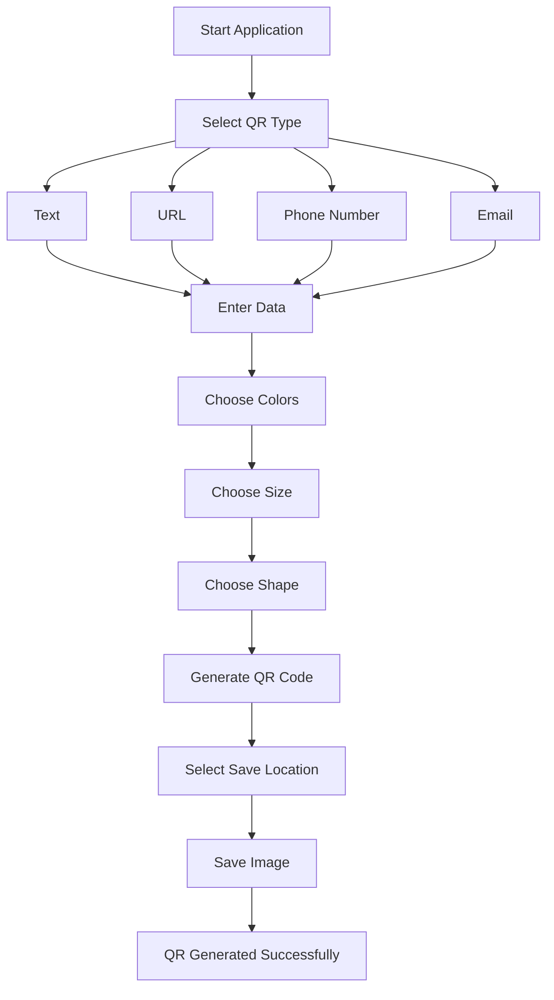
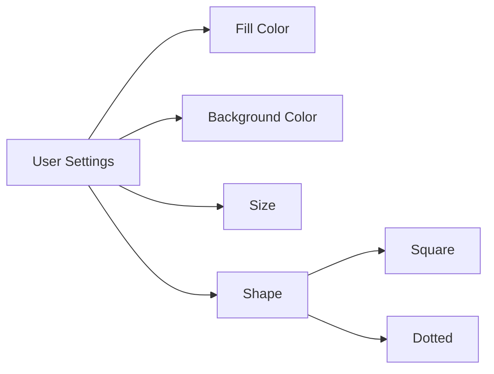

# 🎯 QR Code Generator


A powerful and customizable **Python-based QR Code Generator** that allows users to create QR codes for multiple data types, customize their appearance, and save them to any desired location.

---

## 📌 Project Overview

This application enables users to generate QR codes for:

- 📝 Text Messages
- 🌐 Website URLs
- 📞 Phone Numbers
- 📧 Email Addresses

Users can also personalize the QR code by choosing:

- 🎨 Fill Color
- 🖼️ Background Color
- 📏 QR Size (5 - 30)
- 🔳 Square Shape
- ⚪ Dotted Shape

If an invalid shape, size, or color is entered, the application automatically uses default settings.

---

# ✨ Features

## 🔹 Multiple QR Types

### 📝 Text QR
Displays custom text when scanned.

### 🌐 URL QR
Opens a website, YouTube video, or any web link directly.

### 📞 Phone Number QR
Launches the phone dialer with the number pre-filled.

### 📧 Email QR
Opens the default email application with the recipient's email already entered.

---

## 🔹 Customization Options

| Feature | Description |
|----------|-------------|
| 🎨 Fill Color | Change QR pattern color |
| 🖼️ Background Color | Customize QR background |
| 📏 Size | Adjustable size from 5 to 30 |
| 🔳 Square Shape | Traditional QR design |
| ⚪ Dotted Shape | Modern circular design |
| 💾 Save Location | Save QR image anywhere |

---

# 🏗️ System Workflow



---

# 🎨 QR Customization Flow



---

# 📂 Project Structure

```text
QR-Code-Generator/
│
├── main.py
├── requirements.txt
├── README.md
│
├── generated_qr/
│   ├── text_qr.png
│   ├── url_qr.png
│   └── ...
│
└── assets/
    └── screenshots/
```

---

# 🚀 How It Works

### Step 1
Choose the type of QR code:

- Text
- URL
- Phone Number
- Email

### Step 2
Enter the required data.

### Step 3
Customize:

- Fill Color
- Background Color
- Size
- Shape

### Step 4
Choose a save location.

### Step 5
Generate and save the QR code.

---

# 📊 Use Cases

### 📚 Education
Share notes, assignments, and study materials.

### 💼 Business
Share websites, contact details, and product information.

### 📞 Contact Sharing
Quickly share phone numbers and email addresses.

### 🎥 Content Sharing
Direct users to YouTube videos and online resources.

---

# ⚙️ Default Settings

If invalid values are entered:

| Parameter | Default |
|------------|-----------|
| Shape | Square |
| Size | 10 |
| Fill Color | Black |
| Background Color | White |

---

# 🛠️ Technologies Used

- Python
- qrcode Library
- Pillow (PIL)
- PyCharm IDE

---

# 📸 Example Output

```text
Input Type : URL
Data       : https://www.youtube.com
Fill Color : Blue
Background : White
Shape      : Dotted
Size       : 15

Output → Customized QR Code
```

---

# 🎯 Future Enhancements

- 🖼️ Logo Embedded QR Codes
- 🌙 Dark Mode UI
- 📱 Mobile Application Version
- 📊 QR Scan Analytics
- 🎨 More Custom Shapes
- ☁️ Cloud Storage Integration

---

# 👨‍💻 Developed By

**Chintana B**

